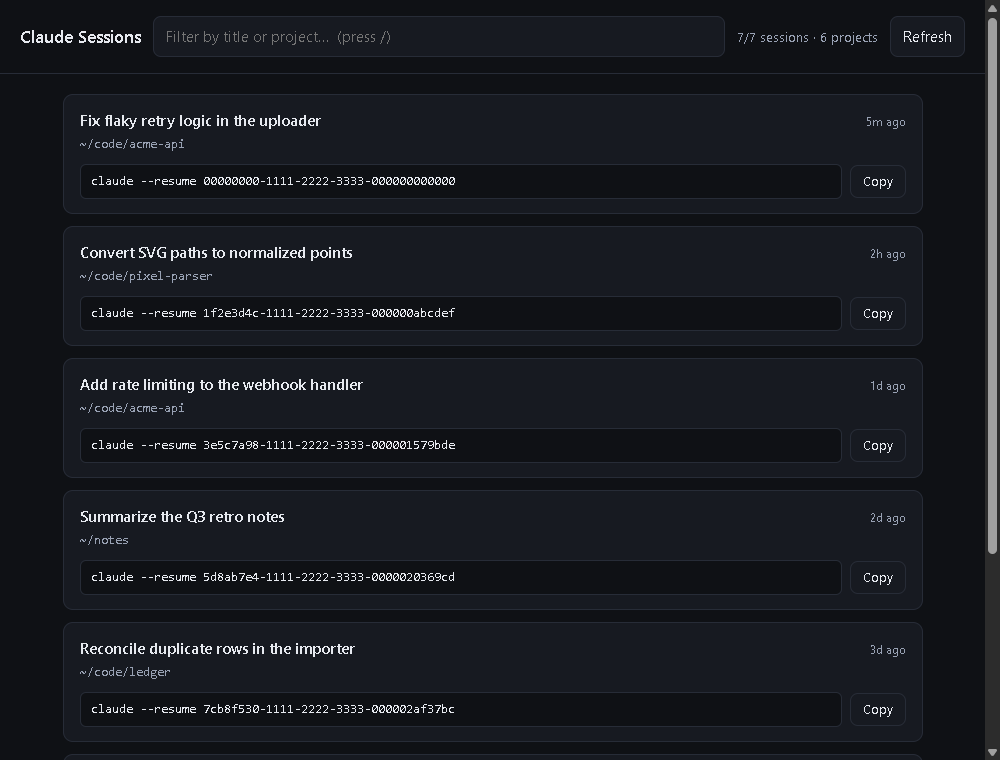

# claude-sessions

Browse every Claude Code session on your machine in a local web page, and copy
the command to resume one with a click.



Claude Code writes one transcript per session under `~/.claude/projects/`.
`claude --resume` gives you a picker in the terminal; this gives you the whole
list at once, searchable, with the command already in your clipboard.

## Requirements

**Python 3.7+.** That's it — standard library only. No npm, no dependencies,
no build step.

**And you must have used Claude Code at least once on that machine.** There is
nothing to install for this part: Claude Code writes a transcript of every
session itself, into `~/.claude/projects/`. The app only reads those files. If
you have never run Claude Code, that folder does not exist yet and the page
will say so — run Claude Code once, then press **Refresh**.

## Run it

```bash
git clone https://github.com/JunayedMh/claude-sessions.git
cd claude-sessions
python3 serve.py
```

It starts on <http://127.0.0.1:8737/> and opens your browser. On Windows use
`python` instead of `python3`.

In the page:

- **Filter** matches the title, the project path, and the session ID at once.
  Press `/` to jump to the box, `Esc` to clear it.
- **Copy** puts `claude --resume <session-id>` on your clipboard. The command is
  printed on the card in full too, so you can read or select it by hand.
- **Refresh** re-reads the files. Only sessions whose files changed get
  re-parsed, so it's near-instant.

## One-word command

On Linux/macOS, add to `~/.bashrc`:

```bash
alias claude-sessions='python3 ~/claude-sessions/serve.py'
```

On Windows PowerShell, add to `$PROFILE` (open it by typing `$PROFILE` in a
prompt; create it with `New-Item -ItemType File -Path $PROFILE -Force`):

```powershell
function claude-sessions { python "$HOME\claude-sessions\serve.py" }
```

## Options

```
python3 serve.py             # start + open the browser (default)
python3 serve.py --no-open   # start the server only
python3 serve.py --selftest  # run the parser's self-check
```

## How it reads your sessions

### Only one level deep, on purpose

It reads `~/.claude/projects/<project>/<session-id>.jsonl` and nothing deeper.

That matters more than it sounds. There are usually far more `.jsonl` files
than there are sessions: Claude Code also writes a transcript for every
subagent it spawns, at
`<project>/<session-id>/subagents/agent-*.jsonl`. Those aren't sessions you can
return to, and `claude --resume` fails on their IDs. On the machine this was
written on, 363 `.jsonl` files contained **215 real sessions** — the other 148
were subagent transcripts.

### Titles

Each card's title is the first of these that exists:

1. the last `ai-title` record — a short title Claude Code generated for the chat
2. the last `last-prompt` record — what the chat was last about
3. the first real user message

Messages that are only tool output, and command wrappers (anything starting
with `<`), are skipped so they can't become a title.

### Project paths

The path shown is the real `cwd` recorded inside the transcript, not the folder
name. Folder names are lossy — `C--Users-me` encodes `C:\Users\me`, so a folder
name alone can't tell you the actual directory.

## Notes

- **Local and read-only.** It binds `127.0.0.1` only, so it isn't reachable
  from your network, and it never writes to your session files.
- **Port busy?** It walks up from 8737 to the first free port and prints the URL
  it settled on. On Windows it also refuses to share a port with an already
  running instance, rather than letting two servers answer on the same port and
  serve you stale data.
- **Unreadable files are skipped**, not fatal — a corrupt or locked transcript
  won't blank the page.

## Development

Everything is two files: `serve.py` (the server and the parser) and
`index.html` (the whole frontend). The parser's self-check covers the title
fallback chain, the subagent exclusion, and the mtime cache:

```bash
python3 serve.py --selftest
```

Its fixture is written with spaces in the JSON on purpose, to catch any parser
that depends on exact JSON formatting.

## License

MIT — see [LICENSE](LICENSE).
